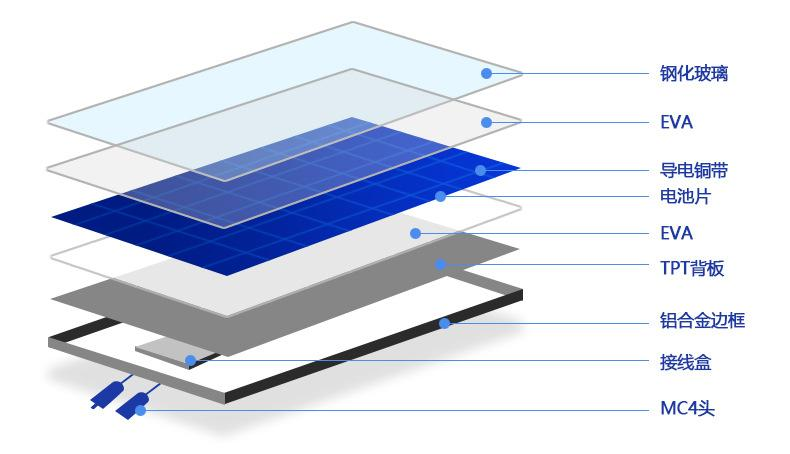
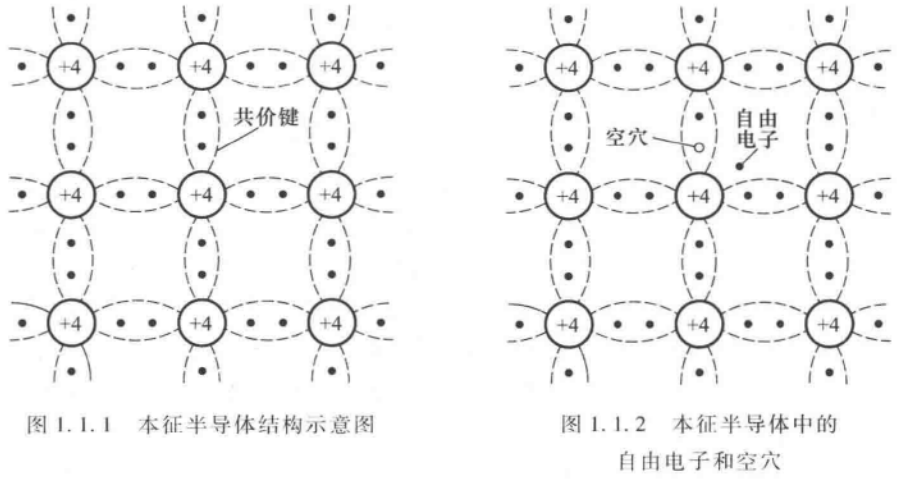

# 光伏 - PV(photo voltaic)

[光伏行业分析 & 背后逻辑 - B站视频](https://www.bilibili.com/video/BV1u44y137yt/)

[光伏行业 产业框架 & 技术简析 - B站视频](https://www.bilibili.com/video/BV1jN411H746)

[维基百科 - 太阳能光伏](https://zh.wikipedia.org/wiki/%E5%A4%AA%E9%98%B3%E8%83%BD%E5%85%89%E4%BC%8F)

## 简介

利用 光伏半导体材料 的 光生伏打效应(Photovoltaic Effect) 而将 太阳能转化为直流电能

核心 : 太阳能电池板

光伏 制造技术门槛(technical barrier)低，扩产周期短，容易 供过于求、产能过剩、价格战

## 产业链

半导体 + 新能源 需求

产业链
1. 硅料(silicon material / raw silicon)
   1. 多晶硅 polysilicon (逐渐被代替)
   2. 单晶硅 mono-crystal silicon (光电转换效率高，性能稳定)
   3. 颗粒硅(硅烷流化床法)、棒状硅(三氯氢硅法)
2. 硅片(silicon wafer)
   1. 硅片 产量以 GW 为单位，关注的是硅片在太阳能电池中的发电能力，而不是硅片的数量或重量
3. 电池板(solar cell/panel)
4. 成品组件(solar/PV module)

业务方向
1. 光伏产品
   1. 单晶
   2. 多晶
2. 光伏系统
   1. 电站
   2. 个人/商用
3. 智慧能源
   1. 管理系统
   2. 云平台
   3. 运维
      1. 清洁(人工、清洁车(车载吊臂(履带、卡车、拖拉机))、机器人(联排挂式，光伏自走))
      2. 
      3. 
      4. 

## 利润分析

度电利润 = 度电收入 - 度电成本(平准化能源成本 LCOE(Levelized Cost of Energy))
1. 收入 由 市场 决定
   1. 供大于求，收入降低
2. 成本 由 原材料&费用 决定
   1. 费用 受 工艺改进 影响
   2. 原材料成本 取决于 和上游供应商的 供需关系

曲线
1. 
2. 解释
   1. 开始没有补贴的情况下，光伏成本高于煤炭，利润 <0
   2. 随着光伏成本降低，和煤炭成本相近，利润 =0
   3. 最后，利润转正，占据市场，电价由光伏决定
   4. 随着产能 过剩/不足 周期波动

度电成本影响因素(可以简化为 : 初始投资成本/发电量)
1. 初始投资成本
2. 运维成本
3. 发电量

度电成本降低方式
1. 降低原材料(工艺)
2. 提高转化效率

利润分配
1. 规模为出货量，用 瓦 表示
2. 使用 每瓦 毛利or净利润 研究利润分配
3. 选择龙头企业
4. 硅料龙头
   1. 
5. 硅片龙头
   1. 
6. 电池片龙头
   1. 
7. 组件龙头
   1. 
8. 趋势图
   1. 
   2. 电池片涨幅 比不上 硅片(电池片上一环节) 涨幅，导致 电池片 单位毛利降低
   3. 原材料硅料 价格上涨，导致 硅料 单位毛利增加
   4. 上游硅料产量还未提升，下游需求大，下游产能利用率(实际产出 与 最大产能 之比)不足(下游提产，但原料没跟上)

需要 提升 竞争壁垒，防止 一窝蜂 扎堆

最安全的是做全产业链，享受光伏行业成长，平滑周期性

## 企业

国内
1. 协鑫科技
2. 天合光能（688599.SH）
3. 中国英利
4. 晶澳科技（002459.SZ）
5. 隆基绿能（601012.SH）
6. 晶科能源（688303.SH）
7. 东方日升（300118.SZ）
8. 尚德电力
9. 正泰集团
10. 横店东磁（002056.SZ）

国外
1. [First Solar](https://firstsolar.com/) - 总部位于美国(全球十大太阳能制造商中唯一一家总部位于美国的公司)
2. [QCells](https://us.qcells.com/) - 被 韩华 收购
3. Canadian Solar 阿特斯（CSIQ.US） - 总部位于加拿大

[InfoLink Consulting - 全球组件出货排名](https://www.infolink-group.com/index/cn/)

中国企业积极布局海外产能
1. 东南亚一体化产能布局加速
2. 欧美布局产能增多(晶澳、隆基、昊能)

## 技术

硅料
1. 
2. 颗粒硅(硅烷流化床法)
3. 棒状硅(三氯氢硅法) - 占比大

硅片
1. 薄片化 - 降低硅耗
   1. 
2. 大尺寸
3. N型硅片(没有光致衰减问题)，在硅晶体中掺入五价元素(磷)形成的半导体材料，自由电子为载流子

太阳能电池分类
1. 
1. 
2. 晶硅电池 - 目前 产业化水平 & 可靠性 最高
3. 单晶硅 容易制备 高品质 PN结，得到更高 光电转换效率，主流选择
4. 单晶硅电池
   1. P型电池(基底掺 硼)，表面掺杂少量的N型材料，制造成本较低，转化效率上限低(受**光致衰减（LID）**的影响)
   2. N型电池(基底掺 磷)，表面掺杂少量的P型材料，没有光致衰减问题，效率通常较高，寿命也更长，但制造成本相对较高
5. 发展路径
   1. AL-BSF (铝背场电池)
      1. 2015之前
      2. 基本淘汰
   2. PERC Cells (Passivated Emitter and Rear Cell 发射极和背面钝化电池)
      1. 2016替代铝背场电池
      2. 转换效率已接近上限
   3. TOPCon Cells (Tunnel Oxide Passivated Contact 隧穿氧化层钝化接触太阳能电池)
      1. 经济性 & 性价比
      2. 扩产主流地位
      3. 近期
   4. Hetero-Junction Cells (HJT 异质结电池)
      1. 处于降本提效关键期
      2. 中期
   5.  Perovskite 钙钛矿叠层电池
      1. 
      2. $ABX_3$ 作为吸光层，制成薄膜型太阳能电池，利用紫外和蓝绿光
      3. 晶硅电池有效利用红外光，与其叠层可以更高效的吸收光谱
      4. 远期

光伏辅材
1. 
2. 逆变器(Inverter)
   1. 功能 直流电(DC) → 交流电(AC)，广泛应用于 光伏发电系统、不间断电源(UPS)、电动车、风力发电
   2. 光伏发电系统的大脑
3. EVA胶膜 & POE胶膜
   1. 封装材料，保护电池片，使阳光尽可能透过
   2. 层压材料(film)，不是涂层(coating)
4. 光伏玻璃
5. 支架
   1. 
6. 银浆(Silver Paste)
   1. 制备电池片金属电极
   2. 以银粉为主要基础材料 + 玻璃氧化物 + 有机树脂/溶剂
   3. 电池片 第二大 成本来源，仅次于 硅片
   4. 正面/背面 银浆，高温(TOPCon)/低温(HJT) 银浆
   5. 国产化高

模电知识
1. 半导体器件，由 P型半导体 和 N型半导体 相接触形成的区域
2. 本征半导体 : 纯净的半导体
   1. 
3. 杂质半导体
   1. 
   2. N型 半导体(negative，对应电子)
      1. 掺杂了 施主杂质(磷，5价元素，提供电子)，在晶体中引入 自由电子(负电荷载流子)
      2. 电子 是主要载流子，靠自由电子导电
   3. P型 半导体(positive，对应空穴)
      1. 掺杂了 受主杂质(硼，3价元素，吸收电子)，在晶体中引入    空穴(正电荷载流子)
      2. 空穴 是主要载流子，靠 空穴 导电
4. PN结 - 单向导电性
   1. 将 P & N 型半导体制作在同一块硅片上，交界面形成 PN 结
   2. 
   3. 空间电荷区(耗尽区)
      1. 空穴 & 自由电子 因为 扩散运动(从高浓度区域向低浓度区域扩散) 复合(电子和空穴消失，留下固定的电荷离子)
      2. P区 出现 负离子区(失去了空穴，留下了固定的负电荷)，N区 出现 正离子区(失去了自由电子，留下了固定的正电荷)
      3. 离子不能移动，形成内电场，方向 N 指向 P
   4. 内建电场的强度增大到一定程度时，内建电场的排斥力刚好平衡了自由电子和空穴的扩散驱动力，达到动态平衡
      1. 对于正电荷，电场力的方向与电场方向相同
      2. 对于负电荷，电场力的方向与电场方向相反
   5. 平衡状态下，不再有新的电子或空穴跨过 PN 结，耗尽区的宽度和内建电场的强度也会保持稳定
   6. 外加正向电压导通
      1. 
      2. 削弱内电场，加剧扩散运动，耗尽区变窄
   7. 外加负向电压截止
      1. 
      2. 加强内电场，阻止扩散运动，耗尽区变宽

